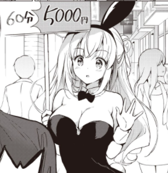

# manga classification

> Classification of manga by transfer learning using pytorch




## How can i validate?

[Download full model](model/full.ft)

And run

```py
import torch
from torchvision import transforms
import PIL

model = torch.load("./full.pt", map_location=torch.device('cpu'))
index = ['1536576', '1570712', '1613730']

with torch.no_grad():
    dtf = transforms.Compose([
            transforms.Resize(256),
            transforms.ToTensor(),
            transforms.Normalize([0.485, 0.456, 0.406], [0.229, 0.224, 0.225])
        ])
    img = PIL.Image.open("./img/1536576.png").convert('RGB')
    img = dtf(img)
    img = img.unsqueeze(0)

    model.eval()
    output = model(img)
index[int(torch.max(output.data, 1)[1].numpy())]
```
